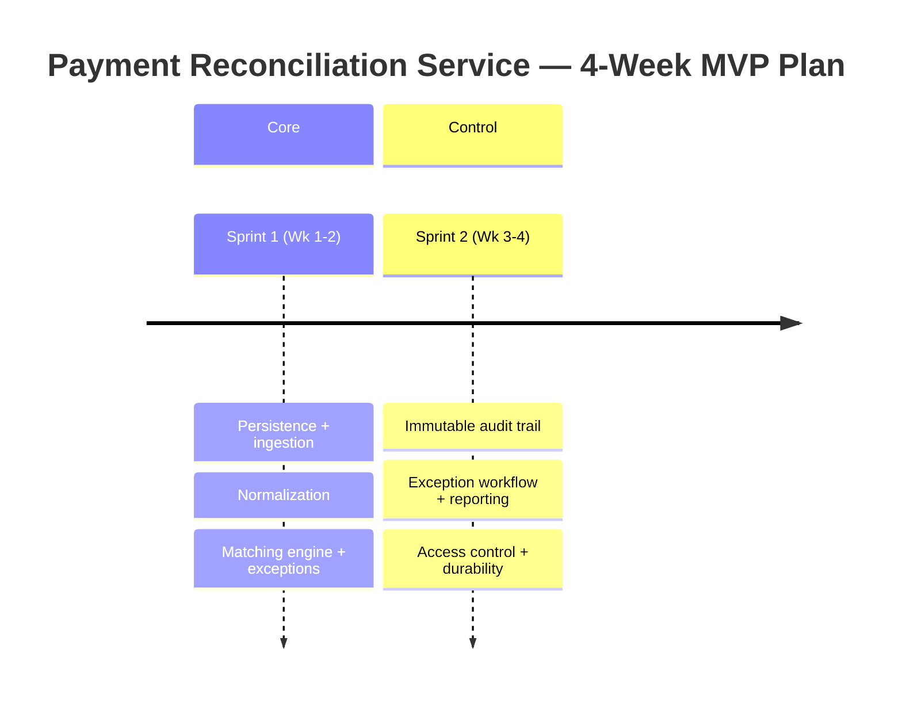

# Payment Reconciliation Service — MVP Implementation Roadmap

**Prepared by**: CodeAIForge
**Version**: 0.1 — September 2026
**Duration**: 4 weeks (2 sprints × 2 weeks)
**Team**: Small team (agent-assisted delivery under human review)
**Methodology**: Vertical slices — each sprint delivers a working, testable increment of the service

---

## Guiding Principles

| Principle                            | In practice                                                                                                               |
| ------------------------------------ | ------------------------------------------------------------------------------------------------------------------------- |
| Correctness over throughput          | A deterministic, auditable match is worth more than a fast one; matching runs are reproducible before they are optimised. |
| Money is never a float               | Every amount is an integer minor unit with an ISO-4217 code — no floating-point currency anywhere in the store.           |
| Auditability is a feature, not a log | The audit trail is append-only domain state, reconstructable end to end — not an afterthought bolted onto logging.        |
| Compliance work escalates            | Anything tracing an `NFR-6.*` requirement runs the full pipeline with mandatory design, security, and compliance gates.   |
| Proportionate control                | A trivial normalization tweak stays light; audit and auth work carries the heavier tier. Governance matches risk.         |

---

## Sprint Overview

| Sprint | Dates  | Theme                     | Alpha-testable?                                                                                       |
| ------ | ------ | ------------------------- | ----------------------------------------------------------------------------------------------------- |
| 1      | Wk 1–2 | Ingestion & Matching Core | Yes — ingest a settlement file and run a reconciliation match, see matches and exceptions             |
| 2      | Wk 3–4 | Workflow, Audit & Access  | **Yes — resolve exceptions under access control with a full immutable audit trail and daily summary** |

**Target MVP**: end of Wk 4
**Buffer**: Sprint 2 P1 items (2.3, 2.5) can slip if behind schedule without breaking the core loop.

### Story Point Reference

| SP  | Effort    | Typical examples                               |
| --- | --------- | ---------------------------------------------- |
| 1   | < 2 hours | Config change, single-field validation         |
| 2   | Half day  | One endpoint, one normalization rule           |
| 3   | ~1 day    | A schema + migration, a workflow state machine |
| 5   | 2–3 days  | The matching engine, the audit trail           |
| 8   | ~1 week   | Architectural refactor — none in this MVP      |

Team capacity: ~18–20 SP per 2-week sprint under human-reviewed agent delivery.

### Sprint Velocity Summary

| Sprint    | Planned SP |
| --------- | ---------- |
| 1         | 18         |
| 2         | 19         |
| **Total** | **37**     |

---

## Sprint 1 — Ingestion & Matching Core

| #   | Task                                                                              | SP  | Priority | Layer    | Depends on | Trace          | Done when                                                                                                                                                          |
| --- | --------------------------------------------------------------------------------- | --- | -------- | -------- | ---------- | -------------- | ------------------------------------------------------------------------------------------------------------------------------------------------------------------ |
| 1.1 | Persistence schema + Flyway migrations (transactions, ledger entries, exceptions) | 3   | Must     | database | —          | FR-1.1, FR-1.2 | A Flyway migration creates the transaction, ledger, and exception tables and `./mvnw flyway:info` shows it applied                                                 |
| 1.2 | Settlement file ingestion endpoint + row parsing                                  | 5   | Must     | api      | 1.1        | FR-1.1         | A 10,000-row file POSTed to the ingestion endpoint persists every parsed row, each retrievable by ingestion ID, with per-row parse errors recorded                 |
| 1.3 | Monetary normalization (integer minor units, ISO-4217)                            | 2   | Must     | api      | 1.1        | FR-1.2         | Amounts persist as integer minor units and a row with an unrecognized currency is quarantined, not stored as valid                                                 |
| 1.4 | Reconciliation matching engine (amount / currency / value-date tolerance)         | 5   | Must     | api      | 1.1, 1.2   | FR-2.1         | A match run marks perfect pairs `matched` and within-tolerance pairs `matched_within_tolerance` with the delta recorded, and is deterministic for identical inputs |
| 1.5 | Exception raising + categorization                                                | 3   | Must     | api      | 1.4        | FR-2.2         | An unmatched ledger entry produces exactly one exception categorized `missing` / `amount_mismatch` / `duplicate` on the exception queue                            |

**Sprint 1 total: 18 SP** (3 + 5 + 2 + 5 + 3)

### Execution Waves — Sprint 1

| Wave | Tasks    | Unblocked because                                 |
| ---- | -------- | ------------------------------------------------- |
| 1    | 1.1      | No dependencies — the schema underpins everything |
| 2    | 1.2, 1.3 | Both depend only on 1.1                           |
| 3    | 1.4      | Depends on 1.1, 1.2                               |
| 4    | 1.5      | Depends on 1.4                                    |

### Tier classification — Sprint 1

- **Complex**: 1.2, 1.4 (SP ≥ 5 → full 8-phase pipeline)
- **Standard**: 1.1 (`database` layer → security phase), 1.5
- **Light**: 1.3

---

## Sprint 2 — Workflow, Audit & Access

| #   | Task                                          | SP  | Priority | Layer     | Depends on | Trace           | Done when                                                                                                                                                                         |
| --- | --------------------------------------------- | --- | -------- | --------- | ---------- | --------------- | --------------------------------------------------------------------------------------------------------------------------------------------------------------------------------- |
| 2.1 | Immutable audit trail (append-only, retained) | 5   | Must     | database  | 1.1        | NFR-6.1         | Every match, override, and resolution appends an audit record that cannot be edited or deleted through the application, and any transaction's trail is reconstructable end to end |
| 2.2 | Exception assignment & resolution workflow    | 3   | Must     | api       | 1.5        | FR-3.1          | An exception cannot reach `resolved` without a recorded resolution reason, and state transitions are append-only and individually timestamped                                     |
| 2.3 | Manual match override + second-approver       | 3   | Should   | auth+api  | 1.4        | FR-2.3          | A manual match records operator ID and timestamp, and an override above the auto-tolerance requires a distinct second approver                                                    |
| 2.4 | Role-based access control (Spring Security)   | 3   | Must     | auth      | —          | NFR-2.1         | An unauthenticated request to any mutating endpoint returns 401 and an authenticated non-reconciler returns 403 on override                                                       |
| 2.5 | Daily reconciliation summary reporting        | 2   | Should   | api       | 2.2        | FR-4.1          | A closed day yields a summary of matched value, unmatched value, and open-exception count by category that reconciles to the underlying records                                   |
| 2.6 | Ingestion durability / idempotent redelivery  | 3   | Must     | api+infra | 1.2        | NFR-3.1, FR-1.1 | A file acknowledged then followed by a restart is neither re-requested nor lost, and duplicate delivery of the same checksum is rejected with a logged reason                     |

**Sprint 2 total: 19 SP** (5 + 3 + 3 + 3 + 2 + 3)

### Execution Waves — Sprint 2

| Wave | Tasks    | Unblocked because                                         |
| ---- | -------- | --------------------------------------------------------- |
| 1    | 2.1, 2.4 | 2.1 depends on 1.1 (done); 2.4 has no Sprint-2 dependency |
| 2    | 2.2, 2.3 | 2.2 depends on 1.5; 2.3 depends on 1.4                    |
| 3    | 2.5, 2.6 | 2.5 depends on 2.2; 2.6 depends on 1.2                    |

### Tier classification — Sprint 2

- **Complex**: 2.1 — traces `NFR-6.1` (Compliance) → full 8-phase pipeline with **mandatory Design + Security + Compliance gates**. This is the governance-escalation showcase.
- **Standard**: 2.2, 2.3 (`auth` layer → security phase), 2.4 (`auth` layer → security phase), 2.6
- **Light**: 2.5

---

## Risk Register

| Risk                                             | Likelihood | Impact | Mitigation                                                                            |
| ------------------------------------------------ | ---------- | ------ | ------------------------------------------------------------------------------------- |
| Matching non-determinism under tolerance windows | Medium     | High   | Golden-input regression test in 1.4; deterministic ordering of candidate pairs        |
| Audit trail mutable via an ORM back door         | Low        | High   | Append-only enforced at the persistence layer (2.1); no update/delete mapping exposed |
| Ingestion double-processing on redelivery        | Medium     | Medium | Checksum-based idempotency (2.6) before parse                                         |
| Access-control gaps on override path             | Low        | High   | Second-approver + method security verified in 2.3/2.4 security phase                  |

---

## Decision Gates

| Gate                | When              | Pass condition                                                                                      |
| ------------------- | ----------------- | --------------------------------------------------------------------------------------------------- |
| Sprint 1 exit       | End Wk 2          | A settlement file ingests and a deterministic match run produces matches + categorized exceptions   |
| Compliance gate     | Before 2.1 merges | Audit immutability and retention verified; Security + Compliance sign-off recorded on the ADR       |
| Sprint 2 exit / MVP | End Wk 4          | Exceptions resolvable under RBAC with a reconstructable audit trail and a reconciling daily summary |
